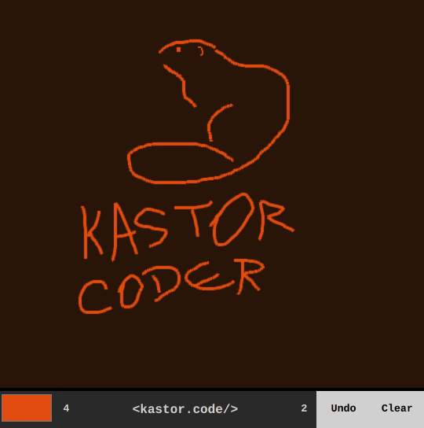

## Drawing Board using RxJS Clone with Web Streams

> 👷 Developed by Matheus Ramalho de Oliveira  
🔨 Brazilian Software Engineer  
🏡 Goiânia, Goiás, Brasil  
✉️ kastorcode@gmail.com  
👍 [instagram.com/kastorcode](https://instagram.com/kastorcode)

---

  This code uses reactive programming by recreating functionality from the RxJS library to use native JavaScript APIs to achieve the same result. Using web streams and the pipeline pattern, we have a drawing board with functionality to change the color and size of the stroke, rewind and clear the entire canvas.

---

### Screenshot

  

---

### Installation and execution

1. Make a clone of this repository;
2. Open the project folder in a terminal;
3. Run `yarn` to install dependencies;
4. Run `yarn start` to launch a server with browser sync at port `3000`.

---

  <big><b>&lt;kastor.code/&gt;</b></big>

